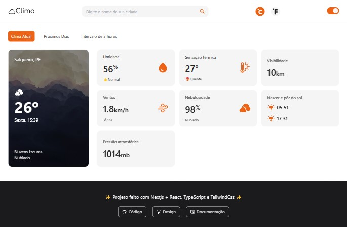
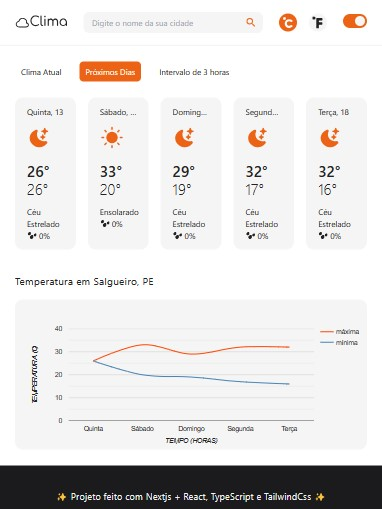
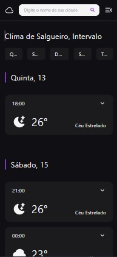

# Clima Website

O site mostra o clima atual e uma previsão dos próximos 5 dias, você pode fazer uma busca por sua cidade e ele apresenta uma série de dados meteorológicos como temperatura mínima e máxima, umidade, velocidade dos ventos, sensação térmica, etc.

Os dados meteorológicos são das API’s [Current Weather Data](https://openweathermap.org/current) e [Hourly Forecast](https://openweathermap.org/api/hourly-forecast), ambas da [OpenWeather](https://openweathermap.org/).

## 🌠 Demo

<a target="_blank" href="https://clima-website.vercel.app/">https://clima-website.vercel.app/</a> <br>

 

<div>
 
&ensp;&ensp;
 
</div>

## 🛠 Tecnologias usadas

-   [Nextjs + React](https://nextjs.org/)
-   [TypeScript](https://www.typescriptlang.org/pt/)
-   [Tailwind](https://tailwindcss.com/)

## 💻💣 Pré-requisitos e Executar

Voce precisa ter o [Git](https://git-scm.com) e o [Node.js](https://nodejs.org/en/) instalado na sua máquina.

```bash
# Clonar repositório
$ git clone https://github.com/u-dani/clima-website.git

# Entrar na pasta clima-website
$ cd clima-website

# Instalar dependencias
$ npm install

# Iniciar servidor
$ npm run dev

# Abrir no navegador :D
$ http://localhost:3000
```
